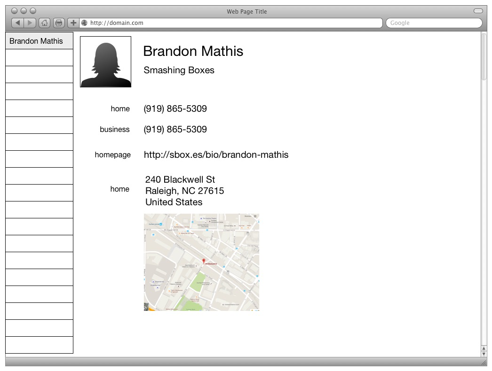

# Address Book

For the final project, you will build a fully featured contacts app in AngularJS. To complete it, the app requires you to use your skills with responsive design and client-side MVC. In addition, you will have to learn to use third party libraries, validation, and client-server architecture.

## Setup

As an additional dependency, we need to install Redis.
Redis is an in-memory key-value store.
In-memory means it does not store data to disk during operation, which makes it very fast.
Key-value stores are simple databases which only store a value and a key to look up that value.
HTML5's local storage API is another example of a key-value store.
Run `brew install redis` to install the database.
Once it has installed, run `redis-server &` to start the database in the background.

Make sure you're in the `address_book` directory, and run `npm install` to install dependencies.

Once that's finished, you're ready to rock and roll.

To start the server, run `npm start` in the console.
This will run the server in the foreground, so you will need to open a new terminal in order to run the client.

Let's try to serve up our Angular app. Run `gulp` in your terminal. You should see a message similar to Server started http://localhost:8080. Navigate to that URL in your browser and verify the app is working.

## Contact Model

This app manages contacts, so we model the contact as an object with the structure below.

```
{
  "name": {
    "first": String,
    "last": String
  },
  "addresses": {
    "business": {
      "phone": String,
      "url": String,
      "location": {
        "line1": String,
        "line2": String,
        "city": String,
        "state": String,
        "zip": String
      }
    },
    "home": {
      "phone": String,
      "url": String,
      "location": {
        "line1": String,
        "line2": String,
        "city": String,
        "state": String,
        "zip": String
      }
    }
  }
}
```

## Acceptance Criteria

* Must have four pages
  * / displays the contact list
  * /:contactId shows the contact
  * /new shows a blank form for creating a new contact
  * /:contactId/edit shows a form filled in with all the contact's information

### Contact list

* Must display the contact's first and last name
* Must be able to delete a contact
* Must be ordered by first name
* Must be grouped by letter of first name

### Show Contact

* Must display the first name
* Must display the last name
* Must display the business name if entered
* Must display the home phone number if entered
* Must display the business phone number if entered
* Must display the home page url if entered
* Must display the address if entered
* Must display a map of the entered address using [Google Maps](https://developers.google.com/maps/documentation/embed/)

### Add/Edit Contact

* Contact must have a first name
* Contact must have a last name
* Contact can have a business name
* Contact can have a home phone number
  * Must have 10 digits
* Contact can have a business number
  * Must have 10 digits
* Contact can have a home page url
  * Must have a valid URL structure (protocol :// host [:port] / path)
* Contact can have an address
  * Has the following components (required marked with asterisk)
    * Line 1*
    * Line 2
    * City*
    * State*
    * Zip code*
  * Must validate the address against the [Lob API](https://lob.com/docs)
* Must be able to cancel
* Must be able to persist to the server


